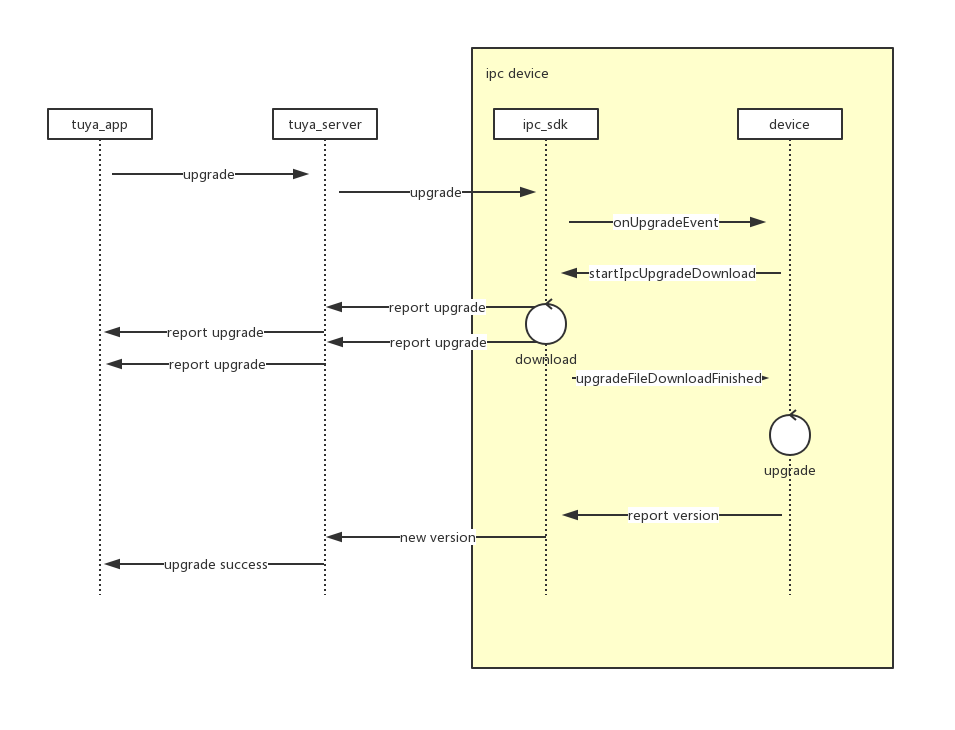

# 升级接口说明

### UML

1. tuya app 发现可以升级后，会提示用户升级，当用户点击升级时会回向 tuya server 发送设备升级请求
2. tuya server 转发 升级请求至 ipc\_sdk 
3. ipc\_sdk 收到升级推送会触发 `com.tuya.smart.aiipc.trans.UpgradeEventCallback#onUpgradeEvent` 接口
4. devcie \(ipc sdk 适用放\) 此时可以决定是否升级，如果升级调用 `((IUpgradeManager) IPCServiceManager.getInstance().getService(IPCService.UPGRADE_SERVICE)).startIpcUpgradeDownload()` 接口，触发 ipc\_sdk 升级文件下载过程. ipc\_sdk 会通过 tuya\_server 像 tuya\_app 汇报升级情况
5. 当 ipc\_sdk 下载完成\(成功或失败\) 会回调`com.tuya.smart.aiipc.trans.UpgradeEventCallback#upgradeFileDownloadFinished` 接口， `success` 用于表明下载升级文件是否成功
6. device 通过升级文件执行升级。 升级文件是配置在后台的文件，所以文件给是，内容都要 设备 自己觉得如何使用升级文件
7. device 升级成功后，需要启动 ipc\_sdk ,并给他新的 版本号, 通过 `com.tuya.smart.aiipc.ipc_sdk.IPCSDK#initSDK(android.content.Context context, java.lang.String ipcVersion)` , `ipcVersion` 会被 ipc\_sdk 检测， 如果是升级目标版本，就会上报升级成功

### ipc sdk 升级相关接口注册

#### com.tuya.smart.aiipc.ipc\_sdk.api.IUpgradeManager

用于处理和 ipc sdk 升级相关 回调注册，和功能触发  
`((IUpgradeManager) IPCServiceManager.getInstance().getService(IPCService.UPGRADE_SERVICE))` 可以获得该接口实例

* `registerUpgradeCallback` 注册`com.tuya.smart.aiipc.trans.UpgradeEventCallback`用于接收 _**升级**_ 和 _**升级文件下载完成**_ 回调
* `startIpcUpgradeDownload` 出发ipc\_sdk 升级文件下载

#### com.tuya.smart.aiipc.trans.UpgradeEventCallback

* `onUpgradeEvent` 升级事件接口
* `upgradeFileDownloadFinished` 升级文件下载完成接口

### 代码截图

